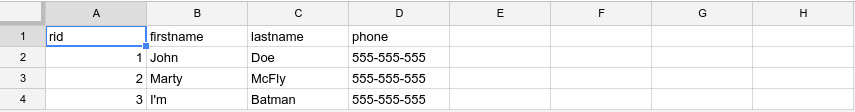

# Drive Spreadsheet Sync

Read and save data to a Drive spreadsheet

* Drive Spreadsheet reads and upserts an array of key/value objects in a Drive spreadsheet, the keys are the values of the first row's cells
* Make sure you don't label your id column `id`
* Make sure you delete all the empty rows under your data in the spreadsheet
* See [Service Account] (https://www.npmjs.com/package/google-spreadsheet#service-account-recommended-method) to configure your credentials

## Install

```sh
npm install
```

## Example

```js
const DriveSync = require('./index');
let testSpreadSheet;
try {
  testSpreadSheet = new DriveSync({
    service_account_credentials: {
      // A Google service account object
    },
    spreadsheet: 'SPREADSHEET_ID', // The big id in your spreadsheet url
    id_column: 'rid', // default rid, tests whether the data is new or must be updated
    sheet: 'My First Sheet', // default 0,
  });
} catch (e) {
  return e;
}

// save
testSpreadSheet.save([
  { rid: '1', firstname: 'John', lastname: 'Doe', phone: '555-555-555' },
  { rid: '2', firstname: 'Marty', lastname: 'McFly', phone: '555-555-555' },
  { rid: '3', firstname: 'I\'m', lastname: 'Batman', phone: '555-555-555' },
], (error) => {
  // Done
});

// read
testSpreadSheet.read((error, data) => {
  /*
  [{ rid: '1', firstname: 'John', lastname: 'Doe', phone: '555-555-555' },
  { rid: '2', firstname: 'Marty', lastname: 'McFly', phone: '555-555-555' },
  { rid: '3', firstname: 'I\'m', lastname: 'Batman', phone: '555-555-555' },]
  */
});
```


